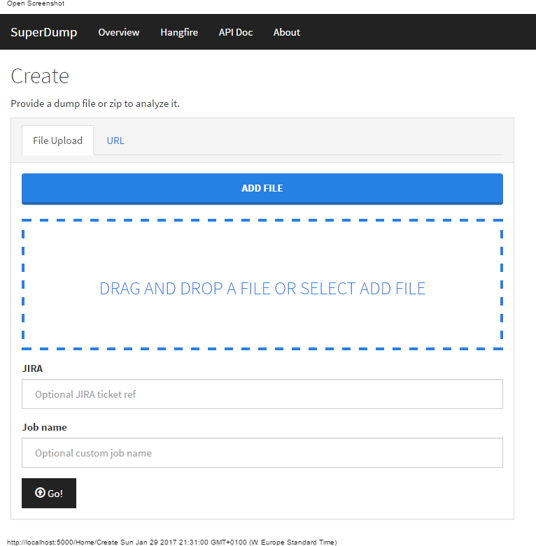
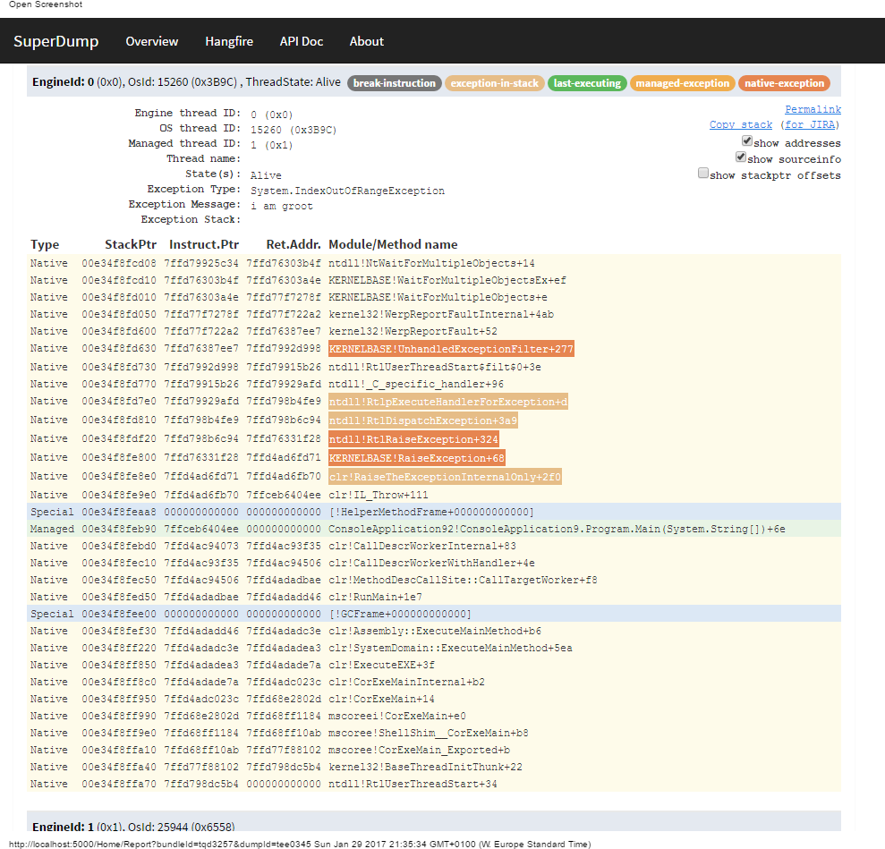
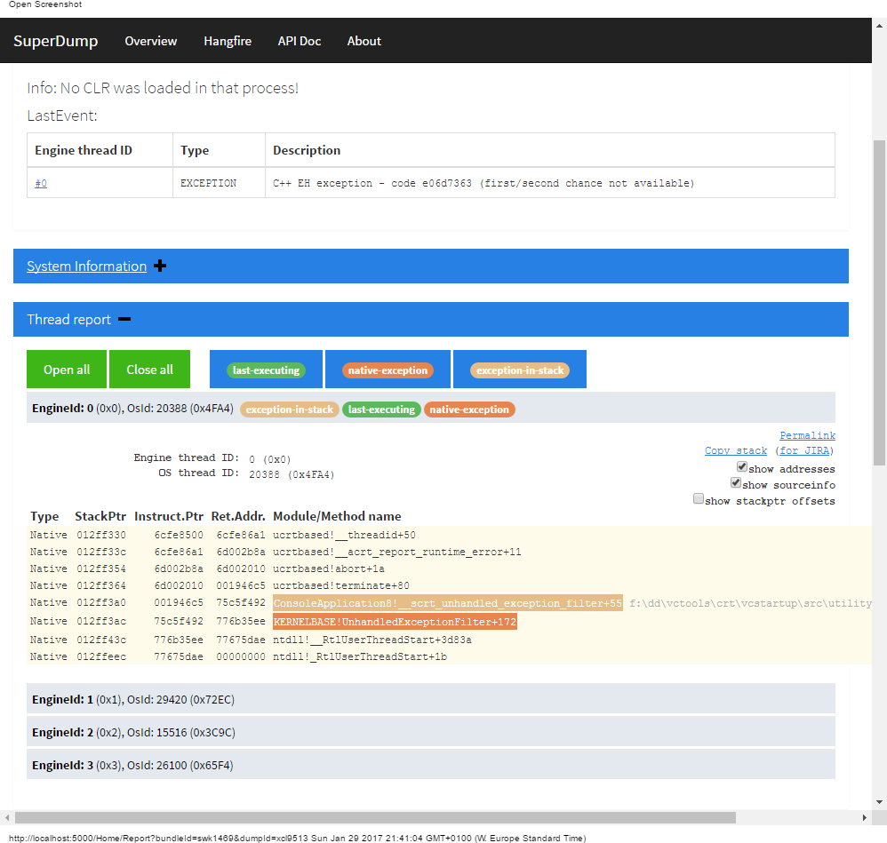
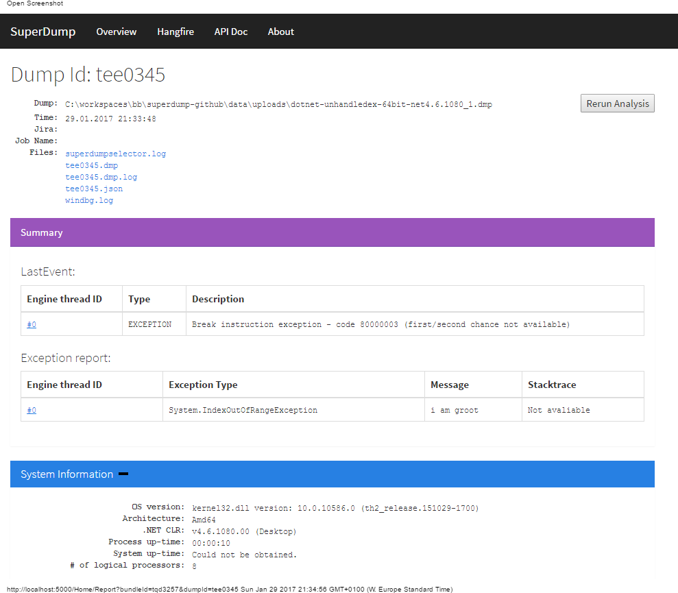
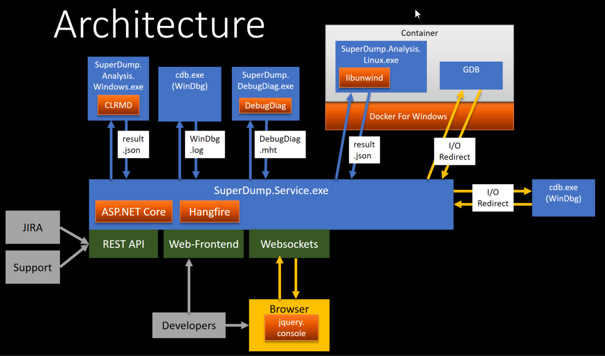

SuperDump
=========

*SuperDump* is a service for **_automated crash-dump analysis_**. It has a web- as well as a REST-interface to upload Windows crash dumps or Linux coredumps.

SuperDump was made with these goals in mind: 

 * Make crash-dump analysis easy for people who are unexperienced with it, or don't have the necessary tools installed.
 * Speed up first assessment of a crash-dump, by automatically preparing crash-dump analysis up-front. A developer should be quicker in determining if it's an already known crash.

What SuperDump is not: 

  * A replacement for in-depth analysis tools such as WinDbg.
  * A windows kernel dump analysis tool.
  
Maintainer: Christoph Neumüller ([christoph.neumueller@dynatrace.com][chnmail], [https://twitter.com/discostu105][chntwitter])

[chnmail]: mailto:christoph.neumueller@dynatrace.com
[chntwitter]: https://twitter.com/discostu105

Docker
=============
Windows analyis can be run simply in Docker for Windows:
 * Have Windows Containers enabled on your Docker for Windows.
 * Just run `docker run -d -p 80:5000 -v superdump:C:\superdump\data\dumps discostu105/superdump`
 * Due to a [Windows/Docker glitch][winglitch], it's not possible to find the service under `localhost:5000` though. Use `docker inspect <id>` to get the IP address of the container and access it directly `<ip-of-container>:80`. This should improve [in future Windows versions][winfuture].

[winglitch]: https://github.com/docker/for-win/issues/221
[winfuture]: https://twitter.com/stefscherer/status/906463103503695872

Features
========
 * Dump analysis can be triggered via web-frontend (HTTP-upload) or via REST-API.
 * Windows-crash-dumps (Fulldump or Minidump) can be analyzed (`.dmp` files). Only process-dumps, not kernel-dumps.
 * Linux-crash-dumps can be analyzed (`.core` files). See <a href="CORE_FORMAT.md">format for core dumps</a>
 * `.zip` files containing multiple crash-dumps are also supported. Each contained dump is processed.
 * Report results are stored as `.json` files and can be queried via REST-API. But they can also be viewed in SuperDump directly.
 * SuperDump report shows: 
   * Basic information (bitness, system/process uptime, lastevent, ...)
   * Loaded modules and versions
   * Stacktraces of all threads (native and .NET frames)
   * AppDomains
   * Basic memory analyis (number of bytes used by .NET types)
   * Linux Signals
 * SuperDump detects exceptions (native and managed) and marks the responsible threads.
 * Deadlock detection.
 * SuperDump also invokes a number of `WinDbg` commands automatically and logs them to a separate log-file.
 * It also invokes DebugDiag Analysis. An `.mht` file is created automatically and can be downloaded.
 * You can enter "interactive mode" for every dump. This will spin up `cdb.exe` (basically WinDbg for the command line) and create a websocket-based console terminal in the browser which lets you analyze the dump more deeply, with out the need to download it and have debugging tools installed locally. (Isn't that awesome?)
 * Linux coredumps (`.core`) are supported too. The analysis is triggered via a docker container (the actual command is configurable via  `LinuxAnalysisCommand`. Note, that linux dumps must be uploaded in archives in a specific format. In addition to the `.core` file, it must also contain linux system libraries as `libs.tar.gz`, otherwise symbols cannot be resolved correctly. If you're interested in seriously using this, please get in touch and we'll document this better. Find more details on linux analysis here: http://epub.jku.at/obvulihs/download/pdf/2581999?originalFilename=true
 * "Interactive mode" for linux coredumps is possible as well. Starts a fully TTY-Compliant browser session with GDB.
 * Slack Notifications for finished analysis (see `SlackNotificationUrls` config setting)
 * Elastic search integration for statistics. Every dump analysis is pushed into elastic search instance, which allows to run statistics on crash dumps.
 * Link to source (see `RepositoryUrl` setting)
 * Duplication detection
 * Optional Ldap Authentication with three user groups:
   * Admin: Has access to the Hangfire Server webinterface and can clean the Elastic Search.
   * User: Can download the dump files, view the stack variables, use the interactive mode and rerun the dump analysis.
   * Viewer: Can upload dumps, view the basic report and download certain log files.
 * Token Authentication for Api
 * Logging of security relevant events.
 * Logging of all webrequests.

Demo
============
Demo-Video: https://youtu.be/XdyDjkW8MDk

Slides about SuperDump (explaining some of the architecture): https://www.slideshare.net/ChristophNeumller/large-scale-crash-dump-analysis-with-superdump

Technologies
============
 * [CLRMD] for analysis.
 * [ASP.NET Core] and [Razor] for web-frontend and api.
 * [Hangfire] for task scheduling.
 * [websocket-manager] for in-browser terminal session for interactive WinDbg session.
 * [gotty] for TTY-enabled browser terminal session with GDB.
 * [Docker for Windows], [libunwind] and [gdb] for Linux analysis.
 
 
 [CLRMD]: https://github.com/Microsoft/clrmd
 [ASP.NET Core]: https://github.com/aspnet/Home
 [Razor]: https://github.com/aspnet/Razor
 [Hangfire]: https://github.com/HangfireIO/Hangfire
 [websocket-manager]: https://github.com/radu-matei/websocket-manager
 [Docker for Windows]: https://docs.docker.com/docker-for-windows/
 [gdb]: https://www.gnu.org/software/gdb/
 [libunwind]: http://www.nongnu.org/libunwind/
 [gotty]: https://github.com/yudai/gotty
 
 

Build
=====

 * Prerequisites:
   * Visual Studio 2019
   * .NET 5
   * .NET Framework 4.8 (developer pack)
   * NPM
   * Bower (npm install -g bower)
   * Git
   * Docker for Windows (for building the docker image for linux analysis)
   * LocalDB (optional, see `UseInMemoryHangfireStorage` setting)
   * DebugDiag (for automatic DebugDiag analysis)
   * When building the first time, remember to create `conf/appsettings.json`
   * Windows Debugging Tools (`cdb.exe`) (optional, for interactive mode)
 * Build via buildscript in `building/*.cmd` (see <a href="building/README.md">README.md</a>)
 * Run via `build/runsuperdump.cmd` (defaults to port 5000)

 Authentication
 ==============
 For authentication it is necessary to add a few settings to either the appconfig.json file, environment variables or using the user secrets file of asp .net.
 * "SuperDumpSettings:LdapAuthenticationSettings:LdapDomain"
 * "SuperDumpSettings:LdapAuthenticationSettings:TokenSigningKey"
 * "SuperDumpSettings:LdapAuthenticationSettings:GroupNames:Admin"
 * "SuperDumpSettings:LdapAuthenticationSettings:GroupNames:User"
 * "SuperDumpSettings:LdapAuthenticationSettings:GroupNames:Viewer"

 When "SuperDumpSettings:LdapAuthenticationSettings:LdapServiceUserMode" is set to "ServiceUser" it is also necessary to specify
 * "SuperDumpSettings:LdapAuthenticationSettings:LdapServiceUserName"
 * "SuperDumpSettings:LdapAuthenticationSettings:LdapServiceUserPwd"

 The user secrets file can be created by right-clicking the "SuperDumpService" Project in Visual Studio and selecting "Manage User Secrets"

 For the https redirection it is necessary to add urls for https and http to the ASPNETCORE_URLS environment variable.

State of the project
====================
SuperDump has been created at [Dynatrace] as an internship project in 2016. It turned out to be pretty useful so we thought it might be useful for others too. Thus we decided to open source it. This project is considered "community supported". No full-fledged support (with SLA's) is provided by Dynatrace.

Though it currently works great for us at Dynatrace, there are areas that need to be improved to make it a high-quality and generally useful tool:

 * Test-Coverage: A couple of unit tests are there, but there is currently no CI to automatically run them. The tests partially depend on actual dump-files being available, which obviously are not in source control. We'd need some binary-store, a prepare/download step, etc to make those run.
 * Some stuff is tailored for our needs at Dynatrace. E.g. we have special detection for Dynatrace Agent stackframes. While this feature probably won't hurt anyone else, it is kind of unclean to have such special detection in place.

Future
======
We've open sourced SuperDump, because we believe it can be helpful for others. Anyone is welcome to contribute to SuperDump. In small ways, or in ways we have not thought about yet. Feedback, github tickets, as well as PR's are welcome.

Some high-level ideas we've been poking around: 

 * _Pluggable analyzers:_ Possibility to write your own analyzers, detached from the main project and pluggable.
 * _Workers:_ Instead of directly invoking analysis by SuperDumpService, a worker should instead invoke those, after fetching jobs from a queue. It would enable to detach actual analysis from the web-frontend. After that step, it would be easier to deploy SuperDump into Kubernetes.
 * _Descriptive summaries:_ The idea is to put the most likely crash-reason in a short descriptive summary text. This is useful if a crash is entered as a bug in a ticket system.

Security
========

A word of caution: SuperDump is meant to be an internal tool to make crash dump diagnosis easier and faster. It is NOT designed to be used as a publicly hosted service. __If you deploy SuperDump, it's recommended to put access restrictions in place on top of the LDAP authentication that SuperDump provides to only allow access for trusted individuals, .__

Known shortcomings:

 * Especially the "Interactive Mode" is basically a window into a shell on the SuperDump server. So far, no effort has been made to properly sandbox that shell process, so a versatile user could break out of the debugger process (cdb/gdb) and gain shell access. Only users with the role `SuperDumpSettings:LdapAuthenticationSettings:GroupNames:User` can enter Interactive Mode.
 * SuperDump allows to upload files that are supposed to contain dumps, logfiles, debug symbols or archives containing such files. Uploading executables is not detected or restricted, which opens to possibility for remote code execution.
 * There is no access restriction between users that uploaded dumps. As soon as user permission `SuperDumpSettings:LdapAuthenticationSettings:GroupNames:User` is given, such a user can download other dumps or enter Interactive Mode. Memory dumps are may contain highly sensitive data, so such access must only be given to trusted individuals.

Credit
======
Most of the initial code base was written by [Andreas Lobmaier] in his summer internship of 2016. It's been maintained and further developed since then by [Christoph Neumüller] and other folks at [Dynatrace]. [Dominik Steinbinder] also contributed large parts, such as Linux analysis, elastic search integration and much more.

Some of the thread analysis code is based on Sasha Goldshtein's work in https://github.com/goldshtn/msos.

Thank you!

[Andreas Lobmaier]: https://github.com/alobmaier
[Christoph Neumüller]: https://github.com/discostu105
[Dominik Steinbinder]: https://github.com/dotstone
[Dynatrace]: https://www.dynatrace.com
[Sasha Goldshtein]: https://github.com/goldshtn

License
=======
[MIT]

[MIT]: https://github.com/Dynatrace/superdump/blob/master/LICENSE
